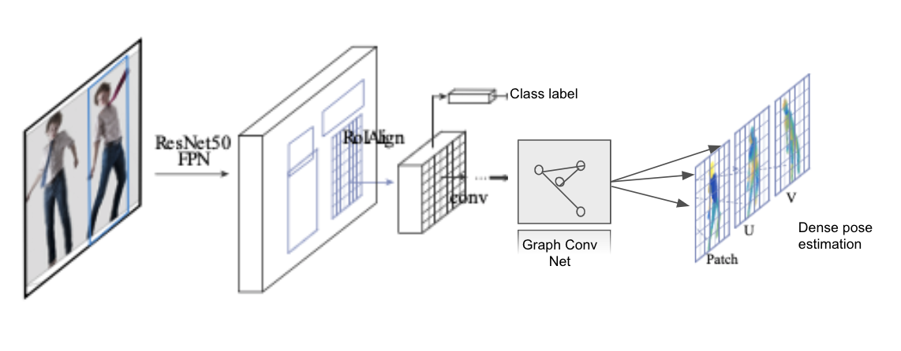

# cs231n-project
# Semantic Segmentation using DensePose with Graph Convolutional Networks

## Context 

Semantic segmentation is a fundamental problem in computer vision, and aims to assign an object class label to each 
pixel in an image. It has numerous applications including autonomous driving, augmented- and virtual reality and 
medical diagnosis. In object detection and instance segmentation, it is not necessary to accurately predict the 
trails of the instance. An inherent challenge in semantic segmentation is that pixels are difficult to classify when 
considered in isolation, as local image evidence is ambiguous and noisy

The approach in [DensePose](#citation) has been to decouple mask and class predictions. Additionally, 
[MaskRCNN](#citation) de-fines a  region-based approach that handles each Region-of-interest (RoI) in parallel so the 
branch of each task can be 
understood as independent NN and identify features of different sizes
The DensePose task involves simultaneously detecting people,  segmenting their bodies and mapping all image pixels 
that belong to a human body to the 3D surface of the  body. 

More recently, Graph Convolution Network (GCN) have been used to capture dependencies generated from non-Euclidean 
domains or complex relationships and interdependence between objects. 

### Project description

 We suggest in this project for the course 
[CS231n-Convolutional Neural Networks for Visual Recognition](http://cs231n.stanford.edu) to apply 
a similar approach of GCN to the task of DensePose classification using the COCO data source and assess if a 
graph structure can capture better the link between the semantic segmentation (person) and the instance-level segmentation.
Thus, based on the different feature extractions in  [DenseReg](#citation), [MaskRCNN](#citation),
 [DensePose](#citation), we believe that the final layer could be improved with a GCN instead of the FCN in 
 [DensePose](#citation).  [DualGCN](#citation) provides an example of the segmentation capabilities of the 
 GCN and the flexibiity if the Adjacency matrix _A_ in capturing dependence among nearby pixels.


Illustration:




```
Structure:
	Readme.md
    /DensePose
        /DensePoseData
    /project_report
        Project_Proposition__cs231n_.pdf
```

## Citation

```
@article{DenseReg,
  title   = "DenseReg: Fully Convolutional Dense Shape Regression In-the-Wild",
  journal = "CoRR" ,
  pages   = "--",
  year    = "2016",
  doi = "http://arxiv.org/abs/1612.01202"
  author  = "Riza Alp Guler and George Trigeorgis and 
    Epameinondas Antonakos and Patrick Snape and Stefanos Zafeiriou and Iasonas Kokkinos"
}
```


```
@article{DensePose,
  title   = "Densepose: Dense human pose estimation in the wild",
  journal = "Proceedings of the IEEE Conference on Computer Vision and Pattern Recognition" ,
  pages   = "7297--7306",
  year    = "2018",
  author  = "Guler, Riza Alp and Neverova, Natalia and Kokkinos, Iasonas"
}
```


```
@article{MaskRCNN,
  title   = "Mask R-CNN",
  journal = "CoRR" ,
  volume  = "--",
  pages   = "--",
  year    = "2017",
  doi = "http://arxiv.org/abs/1703.06870"
  author  = "Kaiming He and Georgia Gkioxari and Piotr Dollar and Ross B. Girshick"
}
```

```
@article{DualGCN,
  title   = "Dual Graph Convolutional Network for Semantic Segmentation",
  journal = "---" ,
  volume  = "--",
  pages   = "--",
  year    = "2019",
  doi = "--"
  author  = "Li Zhang and Xiangtai Li and Anurag Arnab and Kuiyuan Yang and Yunhai Tong and Philip H. S. Torr"
}
```
